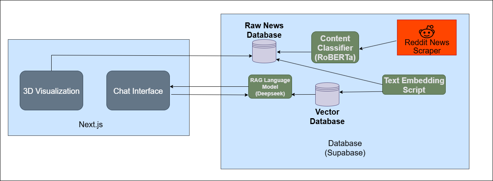

# Symbione
*Inspired by the vastness of space and the intricate connections of human emotion, with a visual theme reminiscent of Christopher Nolan's "Interstellar."*

### The Genesis of the Name

**Symbione** is a portmanteau of "symbiosis" and "one."

**Symbiosis** describes a close and long-term interaction between two different biological species. Often, this relationship is mutually beneficial, creating a system where the whole is greater than the sum of its parts.

By adding **"one,"** we extend this concept to humanity's collective consciousness. Symbione aims to create a unified, symbiotic understanding of global events, not just by what is happening, but by how it makes us *feel*. It brings together disparate news sources into a single, emotionally coherent landscape.

## Overview
Symbione is an emotionally intelligent news platform that redefines how we experience and understand the news. Our advanced AI-powered system analyzes global news sentiment in real-time, revealing the emotional landscape of world events. News articles are categorized into eight core emotional "octants"—such as Joy, Trust, Fear, and Surprise—and presented through stunning, interactive 3D visualizations.

## ✨ Features

Explore the world's news through a new lens of emotion!

### 🌌 Premium Octant Space
Dive into an interactive 3D visualization of news data. Each particle represents a news article, color-coded by its dominant emotion.
*   **Explore real-time and historical data.**
*   **View detailed emotional distribution and live statistics.**
*   **Interact with the data:** Click and drag to rotate, scroll to zoom, and hover to see article details.

### 📈 Trending Emotional News
Discover the most emotionally intense stories from various news and politics communities.
*   **Live, AI-classified news data.**
*   **Advanced filters** to sort by emotion, subreddit, or specific keywords.
*   **Intensity meters** show the emotional strength of each story.

### 🤖 Emotional News Assistant
Engage with our AI-powered chat assistant to gain deeper insights into the emotional landscape of global news.
*   **Understand emotional trends** and get summaries of news based on emotion.
*   **Ask questions** about specific topics or events.
*   Powered by a RAG LLM to provide accurate, context-aware answers.

### 📅 Emotional Timeline
Journey through the year's emotional landscape of global news.
*   **Select any date** to see a detailed breakdown of emotions for that day.
*   **Discover the "Anchor Story"**—the most significant event that shaped the day's emotional tone.
*   **Track emotional volatility** and dominant emotions over time.

Symbione is built with a modern, powerful tech stack to deliver a seamless and responsive experience.

## 🛠️ Technologies Used

*   **Frontend**: React, Next.js, Tailwind CSS
*   **3D Visualization**: Three.js
*   **Backend & Database**: Supabase
*   **AI & Machine Learning**:
    *   **Emotion Classification**: RoBERTa model
    *   **News Assistance**: RAG (Retrieval-Augmented Generation) with Deepseek LLM

## License